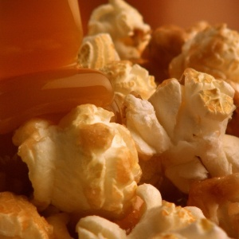
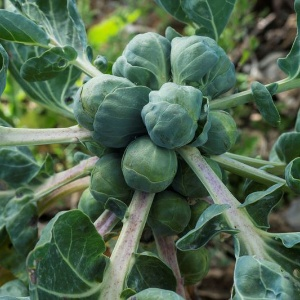
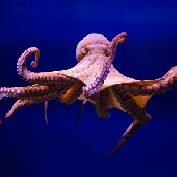
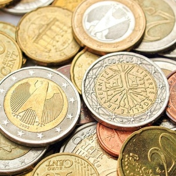

# **Joyce Kuoh Moukouri**
## [Home](README.md) • [Data Science Projects](datascience.md) • [Resume](CV_JKM_2023_eng_online.pdf) 
---
## Data Science Projects
---
<html>
<head>
    <link rel="stylesheet" type="text/css" href="style.css">
</head>
<head>
    
</head>
<body>
    

        

            <a href="https://github.com/joycekuohmoukouri/world_bank_ed">
                
                
 Exploratory Analysis of the WORLD BANK education data 

            </a> 
        

        

            <a href="https://github.com/joycekuohmoukouri/snack">
                
                
 Parisians, don't snack in the metro. 

            </a>   
        
           
        

            <a href="https://github.com/joycekuohmoukouri/Seattle_Net_Zero">
                
                
 Regression model for Seattle (WA) Net Zero Goal 

            </a>
        

        

            <a href="https://github.com/joycekuohmoukouri/olist_client_segmentation">
                
                
Clustering model for client segmentation, spoiler : some will always be unhappy 

            </a>         
        

        

            <a href="https://github.com/joycekuohmoukouri/Neural_Networks_tidying">
                
                
 Deep learning for a multi-class classification model, if it sparks joy tidy it right 

            </a> 
        

        

            <a href="https://github.com/joycekuohmoukouri/Creditworthiness-scoring">
                
                 
 Creditworthiness scoring model, Dashboard for a transparent approach (near completion) 

            </a> 
        

    

</body>
</html>
