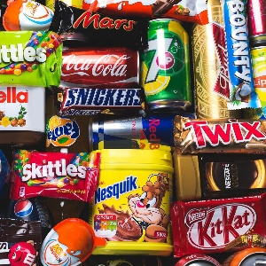
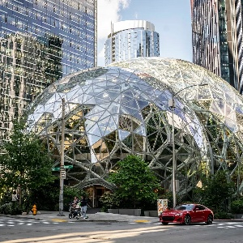

# **Joyce Kuoh Moukouri**
## [Home](README.md) • [Data Science Projects](datascience.md) • [Resume](CV_JKM_2023_eng.pdf) 
---
## Data Science Projects
---
<html>
<head>
    <link rel="stylesheet" type="text/css" href="style.css">
</head>
<head>
    
</head>
<body>
    

        

            
            
 EDA of the WORLD BANK education systems data 

        

        

            
            
 Parisians, don't snack in the metro.  

        
           
        

            
            
 Seattle (WA): Objective Net Zero | Prediction of the greenhouse gaz emission and energy consumption of Seattle buildings 

        

        

            
            
Client segmentation for OLIST | spoiler : some will always be unhappy 

        

        

            
            
 Deep learning for a multi-class classification model |  

        

        

            
            
Project 7: Description goes here

        

        

            
            
Project 8: Description goes here

        

        

            
            
Project 9: Description goes here

        

        

    

</body>
</html>

